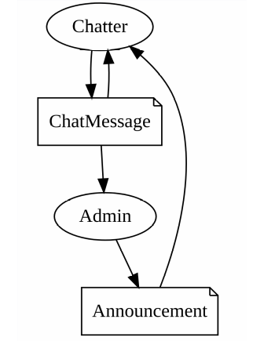
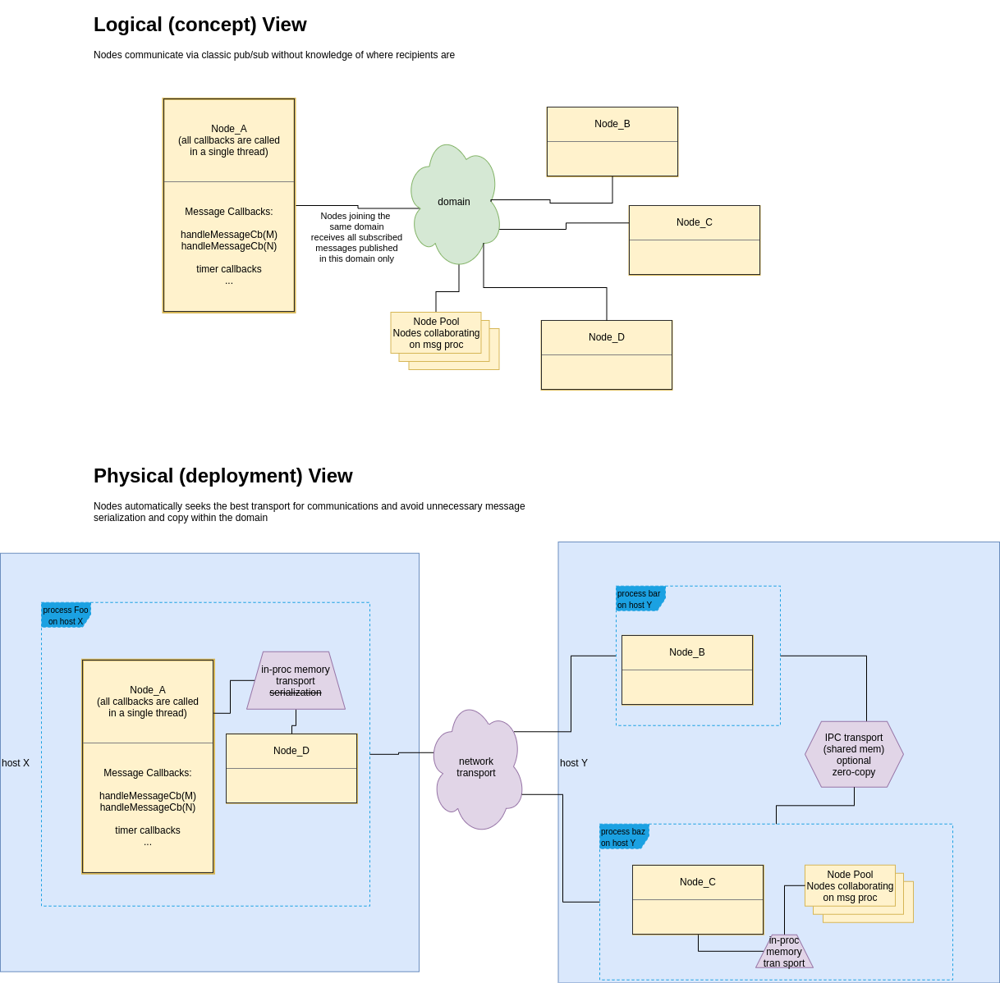
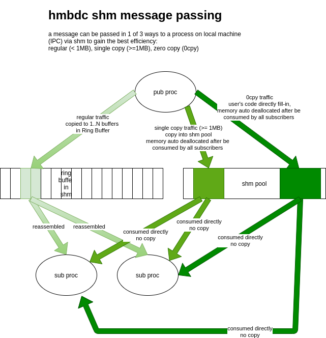
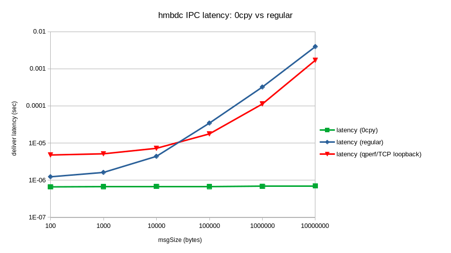
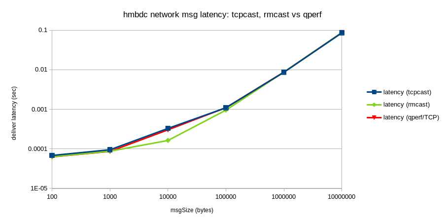
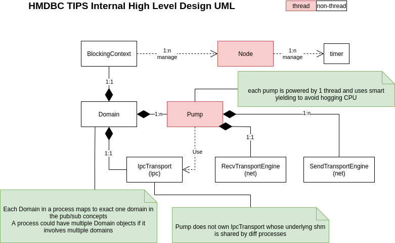
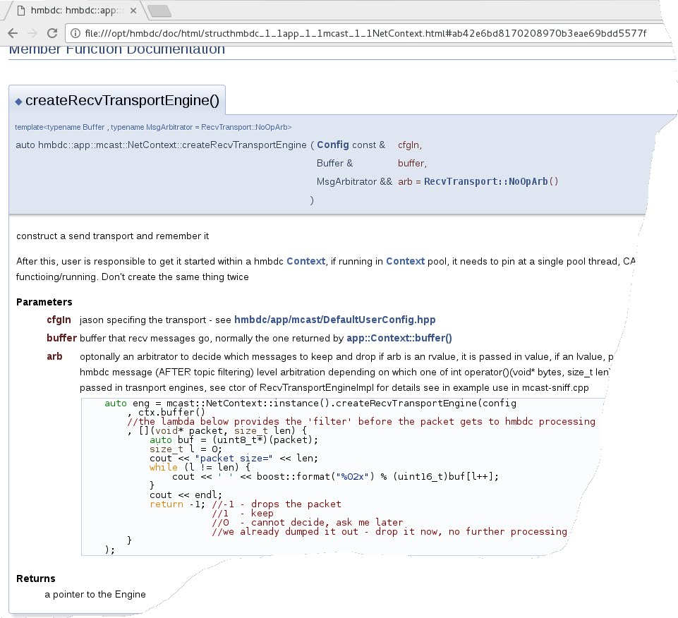

# README #

hmbdc is an open source *headers only* C++ framework and library built on top of various real-world tested lockfree algorithms that facilitate ultra low latency and high throughput messagin (inter-thread, inter-process and thru network) programming. It aims to take most out of the allocated hardware resources (memory, cores, NICs and switches) to achieve latency and throughput goals. It works as a framework but it can also be used as libraries to collaborate with other frameworks or extend existing middleware capability with 'zero-copy', 'reliable multicast', 'kernel bypassing' etc, etc.

Keywords and features:
- Supports x86_64, aarch64, Linux, gcc(>=8.4.1>), clang(>=10)and QNX/qcc(>=11, beta)
- multithreaded without the headache
- support easy to use symetric (no broker process) C++ type based message (both reliable and latest only) publish / subscribe with automatic pub/sub topology visualization and message recording / playback tools
- support message recording (bags) and playback in real-time simulation
- support multiple types of transport mechanisms with the consistent look and feel C++17 API:
    interthread
    interprocess
    UDP multicast
    TCP
    reliable multicast
- other high performance computing features: high speed async logging, timer, rate control ...
- straightforward integration with any other programming languages that supports Linux piping
- provide performance measurement tools

## What is this repository for? ##
* it is used in areas that are cpu / network intensive with high performance (latency / throughput) requirements such as high frequency trading, high performance server-backend, robotics, distributed real-time systems, etc. hmbdc helps you get it done quick and fast.

## Communication model ##
hmbdc offers both C++ Type Inferred Pub/Sub (TIPS) and the higher level Pub/sub On Topic String (POTS). You can either publish in form of C++ types or in form of bytes on different string topics.
Here is an example pub/sub [topology](https://dreampuf.github.io/GraphvizOnline/#digraph%20chat%20%7B%0D%0A%22Chatter%22%20%5Bshape%3Dellipse%5D%3B%0D%0A%22Announcement%22%20%5Bshape%3Dnote%5D%3B%0D%0A%22Announcement%22%20-%3E%20%22Chatter%22%3B%0D%0A%22Chatter%22%20%5Bshape%3Dellipse%5D%3B%0D%0A%22ChatMessage%22%20%5Bshape%3Dnote%5D%3B%0D%0A%22ChatMessage%22%20-%3E%20%22Chatter%22%3B%0D%0A%22Chatter%22%20%5Bshape%3Dellipse%5D%3B%0D%0A%22ChatMessage%22%20%5Bshape%3Dnote%5D%3B%0D%0A%22Chatter%22%20-%3E%20%22ChatMessage%22%3B%0D%0A%22Admin%22%20%5Bshape%3Dellipse%5D%3B%0D%0A%22ChatMessage%22%20%5Bshape%3Dnote%5D%3B%0D%0A%22ChatMessage%22%20-%3E%20%22Admin%22%3B%0D%0A%22Admin%22%20%5Bshape%3Dellipse%5D%3B%0D%0A%22Announcement%22%20%5Bshape%3Dnote%5D%3B%0D%0A%22Admin%22%20-%3E%20%22Announcement%22%3B%0D%0A%7D) generated from C++ code (see TIPS function *printNodePubSubDot*):



Serialization/copying is only performed when it is absolutely necessary. The key concepts are [Node](https://www.dre.vanderbilt.edu/~schmidt/PDF/Active-Objects.pdf) and Domain



The communications within local host nodes are automatically carried out via shared memory. On top of that, user can also opt to use zero-copy messages to acheive the best latecy for communicating large messages between Nodes on the same host.



## Performance ##
### Test environment ###
- Intel(R) Core(TM) i7-4770K CPU @ 3.50GHz 8 core 16G RAM, Ubuntu 20.04
- Intel(R) Xeon(R) CPU E5-2670 0 @ 2.60GHz, Ubuntu 21.04
- 1G CISCO SG200 switch (intel 82574L and 82579LM NIC)
- All results are also compared with qperf in the same enviroment

### Intra-host IPC ###

### Inter-host Network ###


### How to reproduce the performance in your own env ###
See [perf-sample.txt](perf-sample.txt)

## Design/Doc ##
hmbdc design uses a mix of OO and C++ generic programming:



API are in doxygen format.



## How do I build code in example and tools dir ##
0. make sure you have the required lib in place: boost-dev package; 
  (make sure you have the QNX or aarch64 cross compiling tools ready if you are building for them. for QNX, source the qnx set env script now)
1. in hmbdc root dir, type ```make```

## Who do I talk to? ##
* MIT Licensed
* please direct questions to hummingbirdcode@gmail.com and thank you for your interests in hmbdc!
  
## Notes ##
* build qnx / aarch64 version of boost
./b2 toolset=qcc target-os=qnxnto threadapi=pthread link=static -l240 --layout=system --without-python cxxflags="-V gcc_ntox86_64_gpp -Wc,-std=gnu++0x -D_LITTLE_ENDIAN" linkflags="-V gcc_ntox86_64_gpp -lang-c++"


